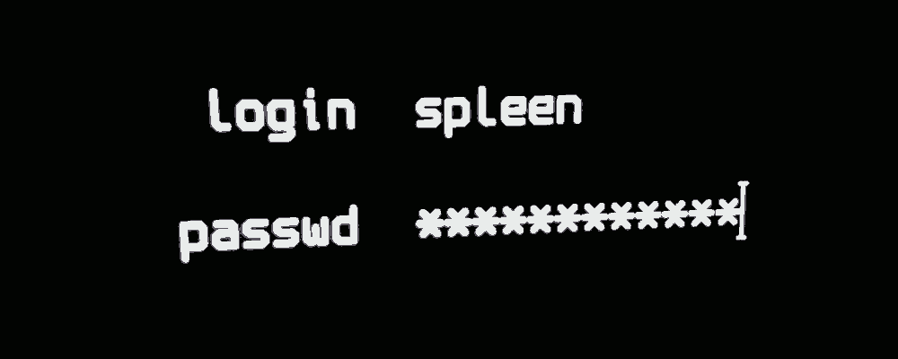

_Tested on [OpenBSD](/openbsd/) 6.3_

# Customize xenodm(1) login screen



Enable [xenodm(1)](https://man.openbsd.org/xenodm.1):

<pre>
# <b>rcctl enable xenodm</b>
#
</pre>

Edit `/etc/X11/xenodm/Xresources`:

```
xlogin.Login.echoPasswd:       true
xlogin.Login.fail:             fail
xlogin.Login.greeting:
xlogin.Login.namePrompt:       \040login
xlogin.Login.passwdPrompt:     passwd

xlogin.Login.height:           180
xlogin.Login.width:            280
xlogin.Login.y:                320
xlogin.Login.frameWidth:       0
xlogin.Login.innerFramesWidth: 0

xlogin.Login.background:       black
xlogin.Login.foreground:       #eeeeee
xlogin.Login.failColor:        white
xlogin.Login.inpColor:         black
xlogin.Login.promptColor:      #eeeeec

xlogin.Login.face:             fixed-13
xlogin.Login.failFace:         fixed-13
xlogin.Login.promptFace:       fixed-13
```

Edit `/etc/X11/xenodm/Xsetup_0`:

```
#!/bin/sh
xsetroot -solid black
```

Logout to check the login screen.

[Use YubiKey for login and SSH](/openbsd/yubikey.html).
