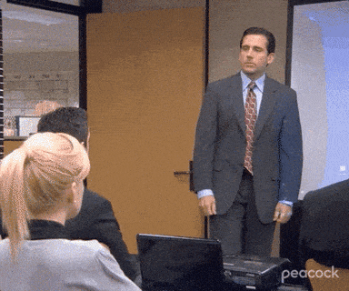

<link rel="stylesheet" href="s.css" /><style>header { display: none; }</style>

# s

minimalist slideshow

just scroll

works on big and small screens

<svg viewBox="0 0 28 10" style="font:20px arial">
  <text x="-1" y="8" fill="#444">svg</text>
</svg>



491 bytes of css

```css
html {
  scroll-snap-type:
  y mandatory;
}

p, pre, h1, h2,
img, svg {
  scroll-snap-align:
  center;
}
```

```html
<link
  rel="stylesheet"
  href="s.css" />

<p>hi</p>
```

[view](https://raw.githubusercontent.com/romanzolotarev/rgz.ee/master/s.md)
[source](https://raw.githubusercontent.com/romanzolotarev/rgz.ee/master/s.css)<br><br>
