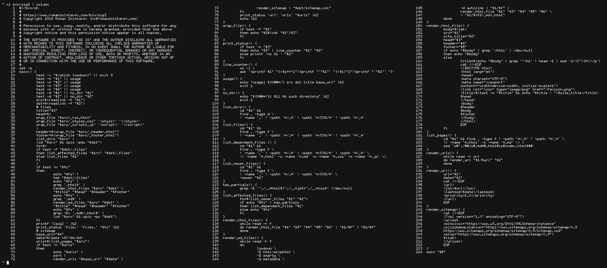

&#8220;I just found <b>ssg</b>!  You are so damn
cool.  I love your approach to things.&#8221;

 
**Derek Sivers** 
_Entrepreneur and Book Publisher_ 
[sivers.org](https://sivers.org "25 Apr 2018")

---

"SSG by @romanzolotarev is an impressively small static site
generator with a tiny installed footprint. Really good for when you
just need the core features." &mdash;
[Simon Dann](https://twitter.com/carbontwelve/status/1028936035143757825 "13 Aug 2018")
(@carbontwelve)

---

_Tested on [OpenBSD](/openbsd/) 6.3_

# Make a static site with find(1), grep(1), and lowdown(1)

[ssg](/bin/ssg3) is a static site generator written in shell and powered by
[lowdown(1)](https://kristaps.bsd.lv/lowdown/).

It converts `*.md` files to HTML.

Unless a page has `<HTML>` tag _ssg3_ extracts its title, wraps it
with `_header.html`, `_footer.html`, and injects `_styles.css`,
`_scripts.js`, `_rss.html` into `<HEAD>`.

Then copies everything (excluding `.*`, `CVS`, and `_*`) from `src`
to `dst` directory.

_214 LoC. [Enlarge, enhance, zoom!](ssg3.png)_

## Install

Download and chmod it:

<pre>
$ <b>mkdir -p bin</b>
$ <b>ftp -Vo bin/ssg3 https://www.romanzolotarev.com/bin/ssg3</b>
ssg3       100% |*********************|    5025      00:00
$ <b>chmod +x bin/ssg3</b>
$ <b>doas pkg_add lowdown</b>
quirks-2.414 signed on 2018-03-28T14:24:37Z
lowdown-0.3.1: ok
$
</pre>

## Usage

<pre>
$ <b>mkdir src dst</b>
$ <b>echo '# Hello, World!' > src/index.md</b>
$ <b>echo '&lt;p&gt;&lt;a href="/"&gt;Home&lt;/a&gt;&lt;/p&gt;' &gt; src/_header.html</b>
$ <b>echo '&lt;p&gt;2018 Roman Zolotarev&lt;/p&gt;' &gt; src/_footer.html</b>
$ <b>ftp -Vo src/_styles.css https://www.romanzolotarev.com/_styles.css</b>
_styles.css  100% |**************************|  1020       00:00
$ <b>bin/ssg3 src dst 'Test' 'https://www'</b>
./index.md
[ssg] 1 file, 1 url
$ <b>find dst</b>
dst
dst/.files
dst/index.html
dst/sitemap.xml
$ <b>open dst/index.html</b>
</pre>

## Incremental updates

On every run _ssg3_ saves a list of files in `dst/.files` and updates
only newer files. If no files were modified after that, _ssg3_ does
nothing.

<pre>
$ <b>bin/ssg3 src dst 'Test' 'https://www'</b>
[ssg] no files, 1 url
$
</pre>

To force the update delete `dst/.files` and re-run _ssg3_.

<pre>
$ <b>rm dst/.files</b>
$ <b>bin/ssg3 src dst 'Test' 'https://www'</b>
index.md
[ssg] 1 file, 1 url
$
</pre>

## Watch

Save this helper to `~/bin/s`. It re-runs _ssg3_ with
[entr(1)](http://entrproject.org) on every file change.

<pre>
$ <b>cat $HOME/bin/s</b>
#!/bin/sh
while :
do find . -type f ! -path '*/.*' |
	entr -d "$HOME/bin/ssg3" . "$1" "$(date)" '//www'
done
$
</pre>

Install entr(1):

<pre>
$ <b>doas pkg_add entr</b>
quirks-2.414 signed on 2018-03-28T14:24:37Z
entr-4.0: ok
$
</pre>

Start the helper and keep it running:

<pre>
$ <b>~/bin/s /var/www/htdocs/www</b>
[ssg] 1 file, 1 url
</pre>

## Upgrade

_[Previous version of ssg](ssg2.html) has been retired._

Add `<HTML>` tag for pages your want to be excluded from parsing.

`ssg2`                       | `ssg3`
:--                          | :--
Wraps pages with `<H1>` tag. | Doesn't wrap pages with `<HTML>` tag.

---

<pre>
&#9484;&#9472;&#9488;&#9484;&#9472;&#9488;&#9484;&#9472;&#9488;
&#9492;&#9472;&#9488;&#9492;&#9472;&#9488;&#9474; &#9516;
&#9492;&#9472;&#9496;&#9492;&#9472;&#9496;&#9492;&#9472;&#9496;
</pre>

---

**Thanks** to
[Mischa Peters](https://twitter.com/mischapeters) for testing and [using this version in production](https://openbsd.amsterdam),
[Kristaps Dzonsons](https://www.divelog.blue/) for
[lowdown(1)](https://kristaps.bsd.lv/lowdown/), and
[Eric Radman](http://eradman.com) for
[entr(1)](http://entrproject.org).
